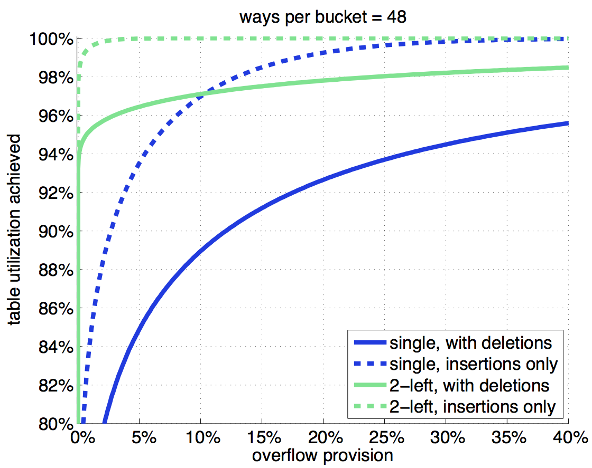

#hash-stats:
###- things your mother never told you about hash tables -
 
 

##The question:
Given a hash table with m buckets, and n entries (hereafter, ways) per bucket, how many overflows are exptected
after inserting a certain number of elements.

Here, we answer this question, and also some related questions. Suppose you can allocate a certain amount of memory for a hash table, and that it cannot be resized. Any insertions that cannot find room in a given hash bucket are stored in an overflow list (i.e. treated separately). You would want to know the following: how much extra memory should I reserve for the overflow list.

Further, what if the table had both insertions and deletions. If the table is heavily loaded, a deletion is very likely to open space in a given hash bucket (many more elements are in the table compared to the overflow list) and an insertion is very likely to cause another overflow (most buckets are full however). Won't this make things worse (yes!)? How much worse?

Surprisingly, this question receives very little treatment by the Wikipedia and most CS lectures on the topic.

##Forward Note & Acknowledgements:
This is meant to be an introduction to the topic and a guide for practitioners. Specifically, it reduces theory to practice.

I learned most of this by reading a paper by Andrei Broder and Michael Mitzenmacher [1] and from a paper by Yossi Kanizo [2]. Mitzenmacher's bibliography is extensive and doubtless much more is covered there, i.e. if one has the need, time, and patience to read it all.

##Notation:
We will use the following notation:

    m: number of hash buckets
    n: number of ways (per bucket)
    u: number of (unique) items inserted into the table (including items that overflow)
    l: total load
    t: table load
    o: overflow percentage
    
Commonly, the load is normalized to the total number of entries in the table.  So we have the following:

    l = u / (m*n)
    t = number-non-overflows / (m*n)
    o = number-overflows / (m*n)

##Observations:
###Number of buckets:
The number of overflows is nearly indepdenent of the number of buckets (i.e. if the number of buckets is large). Hereafter, we assume the number of buckets is large and the number of overflows do not depend on the number of buckets. We also show this to be true, both analytically and empirically.

###D-Left versus Single Hash:
There are many variations on a hash table. One very effective improvement is to use two (or more) disjoint hash tables with separate hash functions. Items are inserted into the least loaded bucket. If all buckets have the same load, then the item is inserted in the "left most" table. D-left provides a significant reduction in overflows, however, it costs at least one memory extra access.

###Hash function:
A strong hash function will produce a uniform random distributino of hash values given an arbitrary non-repeating sequence of keys. So the bucket loads will form a binomial distribution. Let's go ahead and get some results.

##Insertions only, single hash:
The number of entries, u, and the probability of hashing to a given bucket, b: 
 
 
The probability that a bucket has load k, and the number of buckets with load k: 
 
 
From the above, one can directly calculate the overflow percentage, o: 
 
Equation (1) combined with (4) has already caused the number of buckets, m, to cancel out once, but m still shows up in the binomial distribution. Without going into detail, we meet the criteria for using one of several approximations to the binomial distribution. Using the Poisson approximation, we have the following: 
 
And voila, the number of overflows is independent of the number of buckets.

##Deletions, and the "fluid model":
Many academic papers (see, e.g., the work of Michael Mitzenmacher) make use of a so-called fluid model to analyze expected hash table performance. We will not justify the fluid model, nor attempt to prove it it in any way. Rather, we present it, along with its results. The fluid model is a set of differential equations whose solutions give the expected distribution of bucket loads. In the fluid model, pk is the fraction of the hash buckets that have at least load k.

For a single hash table, insertions only, we have: 
 
Here, the term lambda is related to the insertion rate, i.e. the table load. The probability that an item is removed from a given hash bucket is proportional to the number of items in that bucket. Including deletions, the fluid model is: 
 
 
Broder and Mitzenmacher provide an insertions only fluid model for a d-left hash table in their paper "Using Multiple Hash Functions to Improve IP Lookups" [2]: 
 
And this is similarly modified to handle deletions: 
 
 
##More concretely, what this repo does:
The matlab code in this repository evaluates equations (7), (8), (9), and (10). Laugh, perhaps you will, but evaluating these equations turned out to be somewhat non-trivial for the author.

###matlab files:
`singh.m`: single-hash, evaluates equations (7) and (8) 
`dleft.m`: 2-left-hash, evaluates equations (9) and (10) 
`plots.m`: uses the above two functions to generate some plots of overflows versus ways and table load

###cpp files:
`singh.cpp`: single-hash, empirically evaluates overflows 
`dleft.cpp`: 2-left-hash, empirically evaluates overflows 

These are here just to double check. These programs simulate a hash table using random number generator to generate a sequence of bucket assignments. So far, the empirical results have matched the analytical results and both results have been compared against hash tables used in practice. So things look pretty solid. If you find a bug, do let me know.

##Results:
###Overflows vs. Ways:
Increasing the number of ways (or associativity) tends to reduce the number of overflows. In general, highly associative hash tables have very few overflows. The plot shows the percentage overflow, `o`, versus number of ways at 100% load, i.e. m*n elements inserted into the table, some fraction of those go to overflow. 

###Utilization Efficiency vs. Overflow Provision:
Given some overflow provision, `o`, the following plot shows the maximum achievable table utilization, `t`. If `t` is not 100%, then there is some space remaining in the hash table when the overflow list is exhausted, i.e. the allocated resources are underutilized. On the other hand, there is (presumably) a much higher cost associated with handling overflows; in specific, it would be contradict our purpose to maintain an overflow list whose size is a large fraction of the hash table size.

For insertions only, 2-left can achieve 100% efficiency with a very small overflow provision (about 2.5%). For the more realistic case including deletions, there are rapidly diminishing returns as the overflow provision is increased: (e.g.) for a single hash function, the table is just above 92% filled at 20% overflow. 

##About me
My name is Pete Stevenson.  
You can send complaints and improvements to me via email:  
`etep` `dot` `nosnevets` `at` `gmail` `dot` `com`.  

##References
1. Andrei Broder and Michael Mitzenmacher, "Using Multiple Hash Functions to Improve IP Lookups."
2. Yossi Kanizo, David Hay, and Isaac Keslassy, "Hash Tables With Finite Buckets Are Less Resistant To Deletions."

